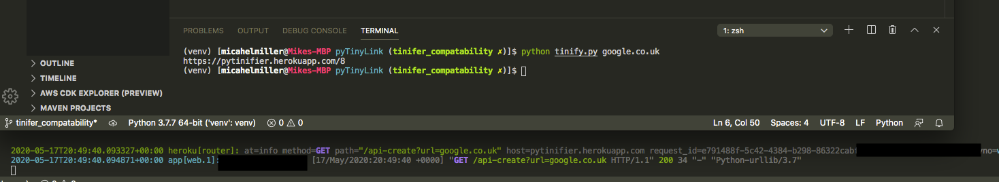

# Tinifier

Demo hosted on Heroku. Data isn't persistant there yet! Postgres coming?

Run it locally in Docker - `docker run -p 5000:5000 --rm --name pyTinifier -it mmillerlb/pytinifier:latest`

Or just with Flask, or with Heroku, or whatever you please.

## What is this

It's a url shortening service, duh! Using Flask and Sqlite.  _Really_ needs Postgres for persistance in Heroku

Small and can run in a container

Has a web UI, and an api endpoint to hit at /api-create !

Have fun

PS - Pairs nicely with [pyTinyLink](https://github.com/mmillerlevels/pyTinyLink/tree/tinifer_compatability)

## API Endpoint

Aside from the WebUI, you can hit a simple api. Simply pass the endpoint your url, in the url variable

`/api-create?url=mozilla.org`

Returns

`https://pytinifier.herokuapp.com/1`

## Pre-Flight

Make sure you set your `FULL_URL` variable. Example would be `https://pytinifier.herokuapp.com/`
